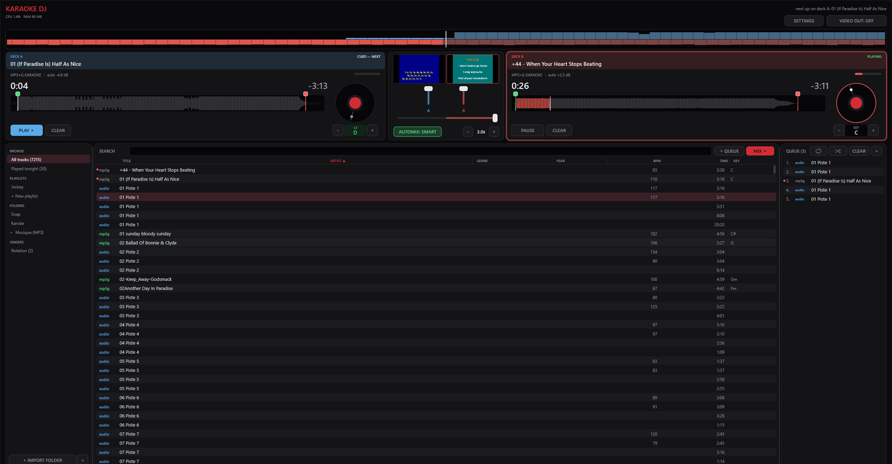
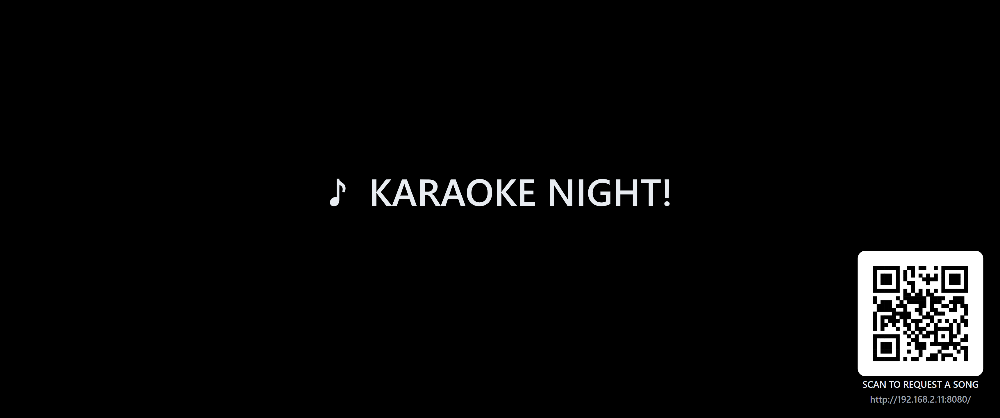

<div align="center">

# 🎤 Karaoke DJ

**A professional two-deck karaoke & video DJ app for Windows — built to run a
full night from a regular laptop, no dedicated GPU required.**

[](https://github.com/MrBeanTheOne/KaraokeDJ/releases/latest)




</div>

## 📥 Install

Grab **`KaraokeDJ-<version>-win64.exe`** from the
[**latest release**](https://github.com/MrBeanTheOne/KaraokeDJ/releases/latest)
and run it. The installer is fully self-contained — yt-dlp and ffmpeg are
bundled, no runtimes to install — and cleanly replaces any older version.
Your library lives in `%APPDATA%\KaraokeDJ\` and survives every upgrade.
The app checks GitHub for newer releases on launch (and on demand in
Settings) and points you at the download when one exists.

## ✨ What it does

### 🎛️ Two decks, zero babysitting
- Automix with configurable fade length, or mix by hand — crossfader fills
  blue (deck A) / red (deck B) from center.
- **Hardware video decode** (Media Foundation + D3D11): smooth video karaoke
  on a weak laptop CPU.
- Plays **MP3+G** (mp3/cdg pairs), **karaoke ZIPs**, **video files**, plain
  audio — and **YouTube links** pasted straight into the search box (point the
  download folder at a library folder in Settings and they import themselves).
- **Key change** on each deck for singers who need the song a step down: the
  readout shows the song's **actual musical key** (detected automatically in
  the background) and `−`/`+` move it, so you set *Am → Gm*, not "minus two".
  Pitch only — the tempo never moves, so the lyrics stay in sync. Click the
  readout to snap back to the original key. Idle until you use it, so nothing
  changes for the songs you play as-is.
- **Start/end markers** per song: drag the handles and the deck re-cues as you
  move them, or let smart automix skip silent intros and outros. Saved per
  track.
- **Auto volume leveling** — loudness is measured per track and matched, so
  nobody gets blasted between songs.
- **BPM and musical key everywhere**: BPM read from tags on import; both
  detected in the background for everything else, in a single pass per track.
  The analysis runs several tracks at once and **stands down completely while
  a deck is playing**, so it never competes with the music — a 100k-track
  library finishes in a couple of hours of idle time.

### 📚 A library that keeps up
- Fast parallel import with live progress; closing mid-import is safe, and a
  mid-gig import drops to background priority so playback always wins.
- Built for **big collections**: 100k+ track libraries browse and search
  smoothly (pre-folded search text, debounced queries).
- **Stays in sync**: right-click a folder to rescan it, one button rescans
  everything, and an optional watcher imports new files by itself seconds
  after they land on disk.
- **Drive letter changed?** Right-click the folder → **relocate** and point it
  at the new location. Your playlists, rotation, history, markers, BPM and
  detected keys all stay attached — no re-import, no re-analysis.
- Accent- and case-insensitive search ("demo" finds "DÉMO").
- **Unplugged drive? Its tracks grey out** and refuse to be queued or loaded,
  so nothing fails mid-gig. They come back by themselves when the drive
  returns. Queueing a multi-selection or a whole playlist takes what it can
  and tells you how many it skipped.
- Sortable, resizable, reorderable columns (title, artist, genre, year, BPM,
  time, **key**) — right-click the header to choose what shows.
- Playlists with drag-reorder, played-tonight dots, and **multi-select
  everywhere** — browser and queue: shift/ctrl-click several tracks, then
  drag or right-click to queue, playlist or rotation them all at once, remove
  them from a playlist or the queue in one go (duplicates are kept apart:
  only the copies you selected go). Dragging into the queue drops at the
  exact spot the indicator shows.
- **Tag editor**: right-click any track to fix artist/title/genre/year — in
  the library only, or written straight into the file's real tags. Real
  cursor editing: click anywhere in a field, arrow keys move, up/down hop
  between lines.
- **Exclude bad versions**: right-click hides a track from search and phone
  requests; an Excluded view brings anything back.

### 🖼️ Design your waiting screen
- Between songs the output shows a screen **you lay out in Settings**: a
  background image (auto-dimmed so text stays readable), logo (transparency
  kept), title, a free message line, "next up", the upcoming singer rotation,
  and the request QR.
- Every element gets a show/hide toggle, a 3×3 position grid and three
  sizes, with a **live preview** right in Settings — and the layout is
  proportional, so a cheap 720p bar TV shows the same design as a 4K panel.
- The whole designer collapses to one line when you're done.

### 🌐 Bilingual
- Full **English / French** interface — one click in Settings, applied
  instantly everywhere including the waiting screen and the phones' request
  page.

### 🎤 Running the night
- **Singer rotation** with per-singer history — reorder by drag, right-click
  to clear for a new night, search any singer to see everything they've sung.
- **Session snapshots**: if the laptop dies mid-gig, relaunching restores the
  night exactly where it stopped. Closing on purpose asks first, then clears
  the decks, the queue, the singer rotation and tonight's played marks, so the
  next night opens on a fresh room. Your library, playlists and markers stay.
- **Settings save as you go** (every few seconds, waiting-screen design
  included) — a crash or kill costs nothing. If the database is ever too busy
  to take a change, the status line says so instead of losing it silently.
- **Audio device recovery**: pulling the USB interface mid-song recovers
  without a restart.
- **Second-screen video output** with letterbox / fill / stretch fit modes.
- **FULL SCREEN mode** for the operator window: one button next to VIDEO OUT
  hides the title bar and covers the taskbar, so a stray click can never
  minimise or close you mid-song. Esc brings the window back.
- **Keyboard shortcuts** for gig ergonomics: `Space` pause/resume the live
  deck, `Ctrl+N` next singer, `↑`/`↓` walk the track list, `Enter` queue,
  `PgDn` skip, `Del` remove from queue, `Esc` back out.
- **Profile transfer**: export settings, playlists, markers, tags, BPM and
  detected keys to a single file and import it on another machine — set up
  once, run anywhere.

### 📱 Phone requests <sub>(optional, off by default)</sub>



- Singers scan a **QR code on the waiting screen** and get a mobile page to
  search the library and request songs under their name.
- Requests land in a **REQUESTS inbox** — you approve into the rotation or
  reject. Per-phone throttling keeps pranksters out.
- Only **singable material** is offered (CDG songs, karaoke ZIPs, tracks with
  "karaoke" in the name) — music videos stay yours.
- Optional **password**: phones enter it once and remember it; change it
  mid-night and everyone is asked again.
- Strictly isolated: when off, no server, thread, or port exists. Only song
  metadata is ever served.

## 🔨 Building from source

Requirements: Visual Studio 2022+ (MSVC x64), CMake 3.21+.

```
cmake -B build
cmake --build build --config Release
build\Release\test_core.exe        # sanity tests
```

The installer additionally expects `redist\yt-dlp.exe` and `redist\ffmpeg.exe`
(not committed — drop in current builds), then:

```
cd build && cpack -C Release
```

SQLite, miniz, cpp-httplib and qrcodegen are vendored (`external/`);
everything else is Windows SDK (Media Foundation, WASAPI,
Direct2D/DirectWrite, Winsock).

## ⚖️ License

**All rights reserved.** The source is public for reference and transparency,
but no use, modification, or redistribution is permitted without written
permission — see [LICENSE](LICENSE). Bundled third-party components keep
their own licenses ([THIRD-PARTY-NOTICES.txt](THIRD-PARTY-NOTICES.txt)).

## 🗂️ Source layout

```
src/app/       app state, UI drawing, engine tick, menus, data/db glue
src/ui/        immediate-mode Direct2D widget kit
src/audio/     WASAPI output + device recovery
src/media/     Media Foundation decode, waveform/loudness/BPM/key analysis
src/playback/  deck engine (transport, mixing, key change, markers)
src/karaoke/   CDG rendering + karaoke ZIP handling
src/video/     video windows (deck previews + fullscreen output)
src/web/       optional phone-request server (embedded page + JSON API)
src/library/   SQLite library, scanner/import, search
```
